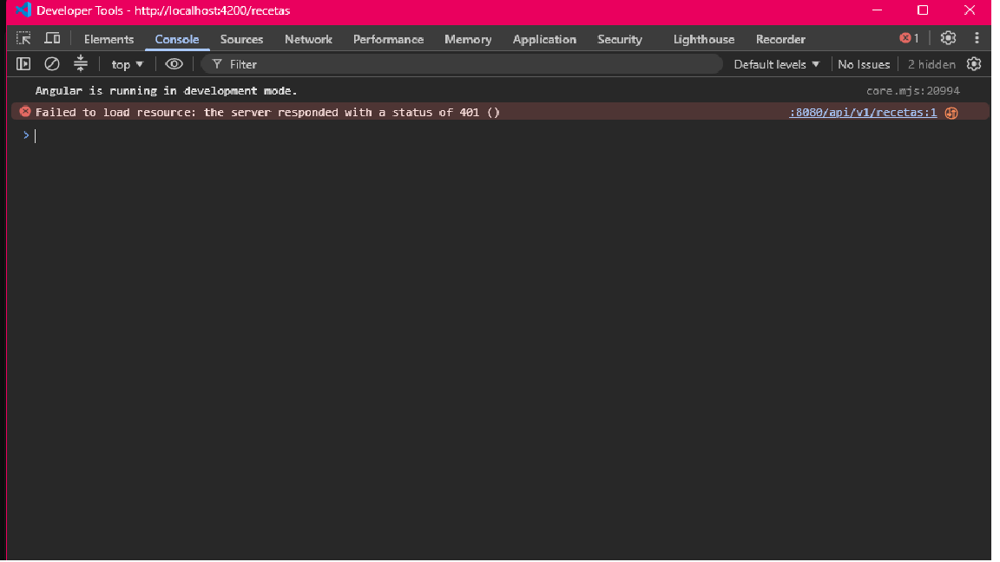

# MedPharm Express — Laboratorio 13

**Universidad de Costa Rica · Sede del Atlántico, Recinto Paraíso**
**Curso:** IF0009 Desarrollo de Software IV · II-2026
**Estudiante:** Daniela Tames Vega · C5K177

## Cómo ejecutar

**Requisitos:** JDK 21, Node.js 20+, Angular CLI 19.

**Backend** (puerto 8080):

cd medpharm-backend
./mvnw spring-boot:run      

**Frontend** (puerto 4200):

cd medpharm-frontend
npm install
npx ng serve

Abrir `http://localhost:4200`.

**Usuarios de prueba** (contraseña password123):

| Usuario | Rol | En la interfaz |
|---|---|---|
| `medico1` | MEDICO | Consulta recetas y emite recetas nuevas |
| `farma1` | FARMACEUTICO | Consulta, despacha y cancela recetas pendientes |

## Error 401

### Procedimiento

1. Se inició sesión normalmente, de modo que el token quedó guardado en `localStorage`.
2. En `app.config.ts` se quitó el registro del interceptor:

   - Antes:  provideHttpClient(withInterceptors([authInterceptor]))
   - Durante la prueba: provideHttpClient()

3. Se navegó a `/recetas`. El guard permitió el acceso (el token sí existe en `localStorage`), pero la petición `GET /api/v1/recetas` falló.

### Evidencia

### ¿Por qué el servidor rechazó la petición?

La API es stateless: no guarda sesiones ni usa cookies (SessionCreationPolicy.STATELESS). Cada petición debe demostrar por sí sola quién la envía, y la única forma de hacerlo es el encabezado Authorization: Bearer <token>.
